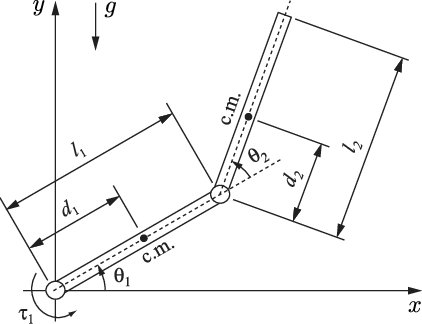

# Pendubot

The pendubot, shown in Fig 1. is the two-link underactuated robotic mechanism.  We will devise the mathematical model by Euler-Lagrange's equations.

Fig 1. Schematic of an pendubot [2]
 

Firstly, we present the kinetic and potential energies, which are used to compute the Lagrangian function. The kinetic energy of the first link is $K_1=\frac{1}{2}(I_1+m_1d_1^2)\dot\theta_1^2$,  where $m_1$ is the first link mass, $\theta_1$ is the first link rotational angle. 

## References
[1] Fantoni, I, Lozano, R, and Sinha, SC. "Non-linear Control for Underactuated Mechanical Systems." Applied Mechanics Reviews 55.4 (2002): B67. Web.
[2] Mathis, Frank & Jafari, R. & Mukherjee, Ranjan. (2014). Impulsive Actuation in Robot Manipulators: Experimental Verification of Pendubot Swing-Up. Mechatronics, IEEE/ASME Transactions on. 19. 1469-1474. 10.1109/TMECH.2013.2293474. 