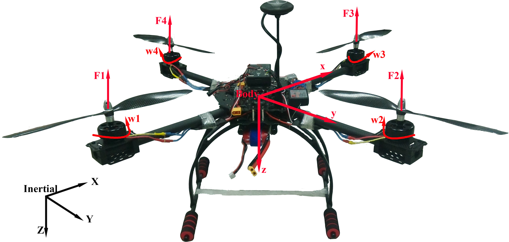

# Quadrotor Dynamics Model

Two reference frames and their corresponding coordinate systems are used to describe the attitude and position of the quadrotor. One is the inertial frame expressed by $I\{x,y,z\}$, and the other is the body-fixed frame expressed by $B\{x,y,z\}$. The structure of the quadrotor is shown in Fig. 1. The construction of the mathematical model is based on the following assumptions: $(a)$ the quadrotor's structure is symmetrical; $(b)$ the quadrotor's body and propellers are rigid; $(c)$ free stream air velocity is zero; $(d)$ the motors' dynamics are relatively fast and can be neglected; $(e)$ the flexibility of the blade is relatively small and can be neglected; $(f)$ drag is supposed to be linear [2] [3].

The mass of the quadrotor is denoted by $m\in\mathbb{R}$ and the inertial tensor $\boldsymbol I=\text{diag}\left(I_{xx},I_{yy},I_{zz}\right)\in\mathbb{R}^{3\times3}$ is defined in the body frame, which is symmetric by assumption $(a)$. Let vector $\boldsymbol \xi=[x,y,z]^T\in\mathbb{R}^3$ and $\boldsymbol \upsilon=[\upsilon_x,\upsilon_y,\upsilon_z]^T\in\mathbb{R}^3$ represent the position and velocity along $x$, $y$ and $z$ axis in the inertial frame, respectively. The elements of $\boldsymbol{\eta}=[\phi \ \theta \ \psi]^T\in\mathbb{R}^3$ are Tait-Bryan Euler angles. Assume that the Euler angles are bounded as follows:
$\phi\in(-\pi/2,\pi/2),\ \theta\in(-\pi/2,\pi/2),\ \psi\in(-\pi,\pi].$

The angular velocities around $x$, $y$ and $z$ axis are denoted by the elements of $\boldsymbol{\omega}=[p \ q \ r]^T\in\mathbb{R}^3$ in the body frame, respectively. The angular velocity vector $\boldsymbol{\boldsymbol{\zeta}}$ is related to the Euler angular velocity vector $\boldsymbol{\omega}$ in the body fixed frame, and the relation can be expressed by $\dot{\boldsymbol{\eta}}=\boldsymbol{R_a^o}\boldsymbol{\omega}$, where $\boldsymbol{R_a^o}$ is a transformation matrix from angular velocity around the axis to euler angular velocity given by
$$
\begin{align} \label{eq:Roa}%绕轴角速度到欧拉角速度的转换
\boldsymbol{R_a^o}=
\left[ \begin{matrix}
   1 & \boldsymbol{s}\phi \boldsymbol{t}\theta  & \boldsymbol{c}\phi \boldsymbol{t}\theta   \\
   0 & \boldsymbol{c}\phi  & -\boldsymbol{s}\phi   \\
   0 & {\boldsymbol{s}\phi }/{\boldsymbol{c}\theta }\; & {\boldsymbol{c}\phi }/{\boldsymbol{c}\theta }\;  \\
\end{matrix} \right].
\end{align}
$$

In the above equation, instead of $\boldsymbol{sin}x\ (\boldsymbol{cos}x,\boldsymbol{tan}x)$,  $\boldsymbol{s}x\ (\boldsymbol{c}x, \boldsymbol{t}x)$ is used for simplicity, with similar abbreviations employed subsequently.
Besides, the linear transformation of a vector from the body-fixed frame to the inertial frame is represented by rotation matrix $\boldsymbol R\in\mathbb{R}^3\times\mathbb{R}^3$ as follows:
$$
\begin{align}       %旋转矩阵R
{\boldsymbol R}=
\left[ %左括号
  \begin{array}{ccc}%该矩阵一共3列，每一列都居中放置
    \boldsymbol{c}\theta \boldsymbol{c}\psi & \boldsymbol{s}\phi \boldsymbol{s}\theta \boldsymbol{c}\psi-\boldsymbol{c}\phi \boldsymbol{s}\psi & \boldsymbol{c}\phi \boldsymbol{s}\theta \boldsymbol{c}\psi+\boldsymbol{s}\phi \boldsymbol{s}\psi\\%第一行元素
    \boldsymbol{c}\theta \boldsymbol{s}\psi & \boldsymbol{s}\phi \boldsymbol{s}\theta \boldsymbol{s}\psi+\boldsymbol{c}\phi \boldsymbol{c}\psi & \boldsymbol{c}\phi \boldsymbol{s}\theta \boldsymbol{s}\psi-\boldsymbol{s}\phi \boldsymbol{c}\psi\\
    -\boldsymbol{s}\theta & \boldsymbol{s}\phi \boldsymbol{c}\theta & \boldsymbol{c}\phi \boldsymbol{c}\theta
  \end{array}
\right].\nonumber
\end{align}
$$

The translational force is $F_l$ in the body frame, which is described by $F_l=\sum_{i=1}^{4}F_i$, where
$F_i$ is the thrust moment generated by each motor. Furthermore, $F_i$ is defined as $F_i=c_{T}{\varpi}_i^2$, where the positive lumped constant parameter $c_T$ denotes the thrust factor of the propeller and ${\varpi}_i$ is the angular velocity of the motor $i$. Then, the input torque $\boldsymbol{\tau_p}$ are given by:
$$
\begin{align}\label{eq:gentorque}
\boldsymbol{\tau_p}=
\left[
  \begin{array}{c}
    {\tau}_{\phi} \\
    {\tau}_{\theta} \\
    {\tau}_{\psi}
  \end{array}
\right]=
\left[
  \begin{array}{c}
    l(F_2-F_4) \\
    l(F_1-F_3) \\
    T_1-T_2+T_3-T_4
  \end{array}
\right],\nonumber
\end{align}
$$
where $l$ is the distance from the motor to the center of gravity and $T_i=c_{Q}{\varpi}_i^2 (i=1\thicksim4)$ is anti-torque generated by motor $i$ with the torque coefficient $c_Q$.

Fig 1. Schematic of a quadrotor with the body frame and inertial frame
 

Using the well-known rigid-body equations[4], the complete mathematical model of a quadrotor can be expressed as
$$
\begin{align}
\dot{{\boldsymbol\xi}}&={\boldsymbol\upsilon},\label{eq:model_a}\\
\dot{{\boldsymbol\upsilon}}&=\frac{1}{m}\left(mg\boldsymbol{\boldsymbol{e_3}}-\boldsymbol RF_l \boldsymbol{e_3}-\boldsymbol{D_\upsilon} {\boldsymbol\upsilon}\right),\label{eq:model_b}\\
\dot{\boldsymbol{\eta}}&=\boldsymbol {R^o_a} \boldsymbol\omega,\label{eq:model_c}\\
\dot{\boldsymbol\omega}&=\boldsymbol I^{-1}(\boldsymbol{\tau_p}-\hat{\boldsymbol\omega}\boldsymbol I\boldsymbol\omega-\boldsymbol{D_\omega} \boldsymbol\omega),\label{eq:model_d}
\end{align}
$$
where $\boldsymbol{D_\upsilon}$ is the lumped drag force coefficient defined by $\boldsymbol{D_\upsilon}=\text{diag}(D_x^i,\ D_y^i,\ D_z^i)$[3], $\boldsymbol{D_\omega}$ is the lumped drag torque coefficient defined by $\boldsymbol{D_\omega}=\text{diag}(D_\phi,\ D_\theta,\ D_\psi)$\cite{novel:modirrousta}, the $hat\ map\ \hat{\cdot}:\mathbb{R}\rightarrow so(3)$ is defined on the condition that $\hat{x}y=x\times y$ for all $x,\ y\in\mathbb{R}^3$, and $\boldsymbol{e_3}=[0\ 0\ 1]^T$.

This mathematical model can be divided into two subsystems: a fully-actuated subsystem ($\ref{eq:model_c}$,$\ref{eq:model_d}$), and an under-actuated subsystem ($\ref{eq:model_a}$,$\ref{eq:model_b}$). Thus, the whole model of the quadrotor is an under-actuated system.

## References
[1] [Y. Wu, K. Hu, X. Sun and Y. Ma, "Nonlinear Control of Quadrotor for Fault Tolerance: A Total Failure of One Actuator," in IEEE Transactions on Systems, Man, and Cybernetics: Systems, doi: 10.1109/TSMC.2019.2917050.](https://ieeexplore.ieee.org/document/8732600)
[2] [Freddi, Alessandro , A. Lanzon , and S. Longhi . "A feedback linearization approach to fault tolerance in quadrotor vehicles." Proceedings of the 18th IFAC World Congress 2011.](https://www.researchgate.net/publication/228569921_A_feedback_linearization_approach_to_fault_tolerance_in_quadrotor_vehicles)
[3] [Bouadi, H. , and M. Tadjine . "Nonlinear Observer Design and Sliding Mode Control of Four Rotors Helicopter." Proceedings of World Academy of ence Engineering & Technology 2(2007):115.](https://www.researchgate.net/publication/228962656_Nonlinear_observer_design_and_sliding_mode_control_of_four_rotor_helicopter)
[4] [Lanzon, Alexander , A. Freddi , and S. Longhi . "Flight Control of a Quadrotor Vehicle Subsequent to a Rotor Failure." Journal of Guidance, Control, and Dynamics (2014).](https://arc.aiaa.org/doi/abs/10.2514/1.59869)